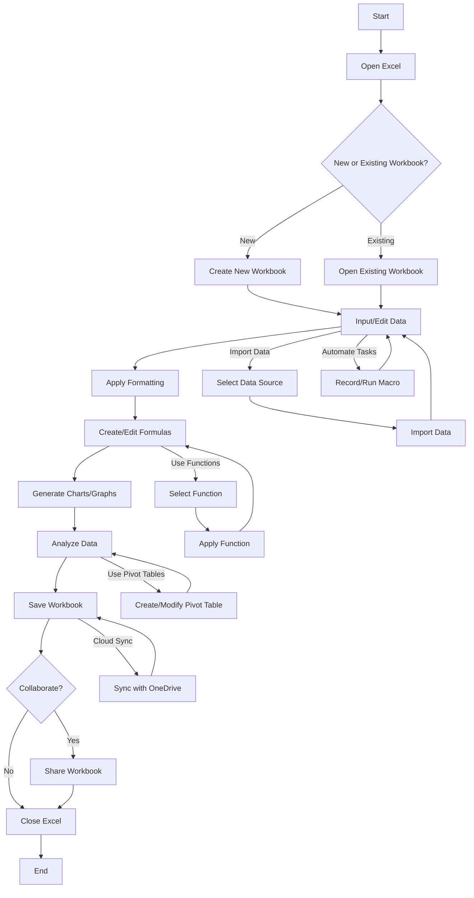
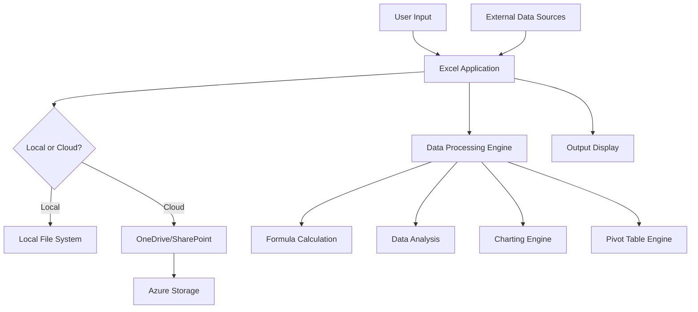

# 1. Introduction

## 1.1 Purpose

The purpose of this Software Requirements Specification (SRS) document is to provide a comprehensive and detailed description of the Microsoft Excel spreadsheet application. This document is intended for:

1. Development team members, including software engineers, designers, and quality assurance specialists
2. Project managers and team leads
3. Stakeholders and decision-makers at Microsoft
4. Third-party integrators and API developers
5. Technical writers and documentation specialists

This SRS aims to clearly define the functional and non-functional requirements, system architecture, and user interface specifications for Microsoft Excel. It will serve as a foundation for the design, development, testing, and maintenance phases of the project.

## 1.2 Scope

Microsoft Excel is a powerful and versatile spreadsheet application designed to meet the data management, analysis, and visualization needs of a wide range of users, from individuals to large enterprises. The scope of this software product includes:

1. Core Spreadsheet Functionality:
   - A grid-based interface for data input and manipulation
   - Support for various data types (numbers, text, dates, etc.)
   - Multiple worksheets within a single workbook
   - Cell, row, and column formatting options

2. Data Analysis and Calculation:
   - Comprehensive formula system for complex calculations
   - Built-in functions for statistical, financial, and logical operations
   - Pivot tables for data summarization and analysis
   - Data sorting and filtering capabilities

3. Data Visualization:
   - Charting and graphing tools to create various types of visual representations
   - Conditional formatting for data-driven cell styling

4. Automation and Customization:
   - Macro recording and editing
   - VBA (Visual Basic for Applications) support for advanced customization

5. Collaboration and Sharing:
   - Real-time collaboration features for multiple users
   - Comments and review tools
   - Sharing and permission management

6. Data Management:
   - Import and export capabilities for various file formats
   - Data validation tools
   - External data connections (databases, web services, etc.)

7. Cross-platform Compatibility:
   - Desktop versions for Windows and macOS
   - Web-based version for browser access
   - Mobile applications for iOS and Android devices

8. Integration:
   - Seamless integration with other Microsoft Office applications
   - Support for third-party add-ins and extensions

9. Cloud Services:
   - Cloud storage and syncing capabilities
   - Version history and backup features

The primary goals of Microsoft Excel are to:

1. Provide a user-friendly interface suitable for both beginners and advanced users
2. Offer powerful data analysis and visualization tools
3. Enable efficient collaboration and data sharing
4. Ensure cross-platform compatibility and accessibility
5. Maintain high performance and reliability when handling large datasets

By achieving these goals, Microsoft Excel aims to benefit users by:

1. Improving productivity in data-related tasks
2. Facilitating better decision-making through advanced analysis capabilities
3. Enhancing communication of data-driven insights
4. Streamlining collaboration within teams and organizations
5. Providing a flexible platform for custom solutions across various industries and use cases

# 2. Product Description

## 2.1 Product Perspective

Microsoft Excel is a core component of the Microsoft Office suite, designed to work seamlessly with other applications such as Word, PowerPoint, and Outlook. It operates within the larger ecosystem of Microsoft's productivity tools and cloud services, including:

1. Microsoft 365: Excel is a key application within the Microsoft 365 subscription service, offering cloud-based features and regular updates.

2. OneDrive: Integration with Microsoft's cloud storage solution for file synchronization and sharing.

3. Power Platform: Excel serves as a data source and analysis tool for Power BI, Power Apps, and Power Automate.

4. Microsoft Teams: Collaboration features are designed to work within the Teams environment for seamless teamwork.

5. Azure: Utilizes Azure cloud services for data processing, storage, and advanced analytics capabilities.

Excel is designed to be cross-platform compatible, with versions available for:

- Windows desktop
- macOS desktop
- Web browsers (Excel Online)
- Mobile devices (iOS and Android)

The product interfaces with various external systems and data sources, including:

- Databases (SQL Server, Oracle, etc.)
- Web services and APIs
- Other file formats (CSV, XML, JSON, etc.)

## 2.2 Product Functions

Microsoft Excel provides a wide range of functions to support data management, analysis, and visualization:

1. Data Input and Management
   - Cell-based data entry and editing
   - Support for multiple data types (numbers, text, dates, currency, etc.)
   - Data validation and error checking
   - Import/export capabilities for various file formats

2. Calculation and Formulas
   - Built-in mathematical, statistical, and financial functions
   - Custom formula creation
   - Automatic recalculation
   - Array formulas and dynamic arrays

3. Data Analysis
   - Sorting and filtering
   - Pivot Tables and Pivot Charts
   - What-if analysis tools (Goal Seek, Scenario Manager, Data Tables)
   - Statistical analysis and forecasting

4. Data Visualization
   - Chart creation (bar, line, pie, scatter, etc.)
   - Conditional formatting
   - Sparklines
   - Advanced chart customization options

5. Collaboration and Sharing
   - Real-time co-authoring
   - Comments and annotations
   - Version history
   - Sharing controls and permissions management

6. Automation and Customization
   - Macro recording and editing
   - VBA programming for custom solutions
   - Add-in support for extended functionality

7. Data Protection and Security
   - Cell, sheet, and workbook protection
   - Data encryption
   - Information Rights Management (IRM) integration

8. Integration and Connectivity
   - Connections to external data sources
   - Power Query for data transformation and loading
   - Integration with other Microsoft Office applications

## 2.3 User Characteristics

Microsoft Excel caters to a diverse user base with varying levels of expertise:

1. Beginner Users
   - Characteristics: Limited spreadsheet experience, basic data entry and simple calculations
   - Needs: Intuitive interface, guided experiences, templates, and basic function assistance

2. Intermediate Users
   - Characteristics: Comfortable with formulas, basic charts, and data analysis
   - Needs: Advanced formatting options, more complex functions, pivot tables, and basic macros

3. Advanced Users
   - Characteristics: Power users, data analysts, financial professionals
   - Needs: Complex formulas, advanced charting, VBA programming, data modeling, and integration with external data sources

4. Business Professionals
   - Characteristics: Managers, executives, decision-makers
   - Needs: Data visualization, reporting tools, collaboration features, and mobile access

5. Data Scientists and Analysts
   - Characteristics: Strong analytical skills, programming experience
   - Needs: Advanced statistical functions, large dataset handling, integration with analytical tools and languages (R, Python)

6. Developers and IT Professionals
   - Characteristics: Technical expertise, system integration focus
   - Needs: API access, extensibility options, enterprise deployment and management features

## 2.4 Constraints

1. Technical Constraints
   - Must maintain backwards compatibility with earlier Excel file formats
   - Performance limitations when handling extremely large datasets (billions of cells)
   - Mobile versions have reduced functionality compared to desktop versions

2. Regulatory Constraints
   - Compliance with data protection regulations (GDPR, CCPA, etc.)
   - Adherence to accessibility standards (Section 508, WCAG)

3. Business Constraints
   - Must align with Microsoft's overall product strategy and release cycles
   - Pricing structure needs to be competitive while supporting ongoing development

4. User Interface Constraints
   - Consistency with Microsoft Office design language and usability standards
   - Limited screen real estate on mobile devices

5. Security Constraints
   - Implementation of robust security measures to protect sensitive data
   - Regular security audits and updates to address potential vulnerabilities

6. Compatibility Constraints
   - Cross-platform functionality may limit the use of platform-specific features
   - Must support a wide range of hardware configurations and operating systems

## 2.5 Assumptions and Dependencies

Assumptions:
1. Users have basic computer literacy and familiarity with spreadsheet concepts
2. The majority of users have reliable internet connectivity for cloud-based features
3. Users are willing to transition to subscription-based models for advanced features
4. The demand for data analysis and visualization tools will continue to grow

Dependencies:
1. Microsoft 365 infrastructure for cloud-based services and collaboration features
2. Azure cloud services for data processing and storage
3. Regular updates to underlying operating systems (Windows, macOS, iOS, Android)
4. Ongoing support and development of VBA and Excel-specific programming languages
5. Third-party developers creating add-ins and extensions to expand Excel's functionality
6. Compatibility with evolving web standards for the online version
7. Continued development of Microsoft's Power Platform for advanced data integration and analysis capabilities

## 2.6 Process Flowchart

The following flowchart illustrates the high-level process flow for a typical user interaction with Microsoft Excel:



This flowchart represents the core processes within Microsoft Excel, including:

1. Opening or creating a workbook
2. Data input and editing
3. Formatting and formula creation
4. Data visualization and analysis
5. Collaboration and sharing
6. Saving and closing the application

The flowchart also highlights key features such as:

- Data import capabilities
- Pivot table creation and modification
- Function selection and application
- Macro recording and execution for task automation
- Cloud synchronization with OneDrive

This process flow demonstrates the versatility of Excel, allowing users to follow various paths depending on their specific needs and level of expertise. The circular nature of some processes (e.g., input/edit data, apply formatting, create/edit formulas) reflects the iterative and flexible nature of working with spreadsheets in Excel.

Here's a breakdown of Microsoft Excel's features with the requested sub-sections:

### 1. Core Spreadsheet Functionality

#### ID
F001

#### DESCRIPTION
Provides a grid-based interface for data input, manipulation, and organization.

#### PRIORITY
High

#### TABLE OF FUNCTIONAL REQUIREMENTS

| ID | Requirement | Description |
|----|-------------|-------------|
| F001.1 | Grid Interface | Provide a customizable grid of cells for data entry and manipulation |
| F001.2 | Data Types | Support various data types including numbers, text, dates, and currency |
| F001.3 | Multiple Worksheets | Allow creation and management of multiple worksheets within a workbook |
| F001.4 | Cell Formatting | Enable formatting options for cells, rows, and columns |
| F001.5 | Undo/Redo | Provide undo and redo functionality for user actions |

### 2. Formulas and Calculations

#### ID
F002

#### DESCRIPTION
Offers a comprehensive formula system for complex calculations and data analysis.

#### PRIORITY
High

#### TABLE OF FUNCTIONAL REQUIREMENTS

| ID | Requirement | Description |
|----|-------------|-------------|
| F002.1 | Formula Bar | Provide a formula bar for entering and editing formulas |
| F002.2 | Built-in Functions | Include a wide range of built-in mathematical, statistical, and financial functions |
| F002.3 | Custom Formulas | Allow users to create custom formulas using cell references and operators |
| F002.4 | Array Formulas | Support array formulas for complex calculations across ranges |
| F002.5 | Auto-calculation | Automatically recalculate results when dependent values change |

### 3. Data Visualization

#### ID
F003

#### DESCRIPTION
Provides tools for creating charts, graphs, and other visual representations of data.

#### PRIORITY
High

#### TABLE OF FUNCTIONAL REQUIREMENTS

| ID | Requirement | Description |
|----|-------------|-------------|
| F003.1 | Chart Creation | Allow users to create various types of charts (bar, line, pie, scatter, etc.) |
| F003.2 | Chart Customization | Provide options to customize chart elements, colors, and styles |
| F003.3 | Conditional Formatting | Enable conditional formatting rules for visual data analysis |
| F003.4 | Sparklines | Support creation of sparklines for compact data visualization |
| F003.5 | Data Bars and Icon Sets | Allow use of data bars and icon sets for in-cell data visualization |

### 4. Data Analysis

#### ID
F004

#### DESCRIPTION
Offers advanced tools for analyzing and summarizing data.

#### PRIORITY
High

#### TABLE OF FUNCTIONAL REQUIREMENTS

| ID | Requirement | Description |
|----|-------------|-------------|
| F004.1 | Sorting and Filtering | Provide options to sort and filter data based on various criteria |
| F004.2 | Pivot Tables | Allow creation and manipulation of pivot tables for data summarization |
| F004.3 | Data Validation | Enable setting of data validation rules to control input |
| F004.4 | What-If Analysis | Include tools like Goal Seek, Scenario Manager, and Data Tables |
| F004.5 | Statistical Analysis | Provide functions and tools for statistical analysis and forecasting |

### 5. Collaboration and Sharing

#### ID
F005

#### DESCRIPTION
Enables multiple users to work on the same spreadsheet and share their work.

#### PRIORITY
Medium

#### TABLE OF FUNCTIONAL REQUIREMENTS

| ID | Requirement | Description |
|----|-------------|-------------|
| F005.1 | Real-time Co-authoring | Allow multiple users to edit the same spreadsheet simultaneously |
| F005.2 | Comments and Reviews | Provide tools for adding comments and reviewing changes |
| F005.3 | Sharing Controls | Enable sharing with customizable permissions |
| F005.4 | Version History | Maintain version history for tracking changes and reverting if necessary |
| F005.5 | Notifications | Send notifications for comments and changes to collaborators |

### 6. Automation and Customization

#### ID
F006

#### DESCRIPTION
Provides tools for automating tasks and customizing Excel's functionality.

#### PRIORITY
Medium

#### TABLE OF FUNCTIONAL REQUIREMENTS

| ID | Requirement | Description |
|----|-------------|-------------|
| F006.1 | Macro Recording | Allow users to record macros for repetitive tasks |
| F006.2 | VBA Support | Provide support for Visual Basic for Applications (VBA) programming |
| F006.3 | Custom Functions | Enable creation of user-defined functions |
| F006.4 | Add-in Support | Support installation and use of third-party add-ins |
| F006.5 | Customizable Ribbon | Allow users to customize the ribbon interface |

### 7. Data Management and Connectivity

#### ID
F007

#### DESCRIPTION
Enables importing, exporting, and connecting to external data sources.

#### PRIORITY
Medium

#### TABLE OF FUNCTIONAL REQUIREMENTS

| ID | Requirement | Description |
|----|-------------|-------------|
| F007.1 | Import/Export | Support importing and exporting data in various formats (CSV, XML, JSON, etc.) |
| F007.2 | External Data Connections | Allow connections to external databases and web services |
| F007.3 | Power Query | Integrate Power Query for advanced data import and transformation |
| F007.4 | Data Refresh | Provide options to refresh data from connected sources |
| F007.5 | Data Model | Support creation and management of data models for complex data relationships |

### 8. Cross-platform Compatibility

#### ID
F008

#### DESCRIPTION
Ensures Excel works across different platforms and devices.

#### PRIORITY
High

#### TABLE OF FUNCTIONAL REQUIREMENTS

| ID | Requirement | Description |
|----|-------------|-------------|
| F008.1 | Desktop Versions | Provide fully-featured versions for Windows and macOS |
| F008.2 | Web Version | Offer a web-based version accessible through browsers |
| F008.3 | Mobile Apps | Develop mobile applications for iOS and Android devices |
| F008.4 | Feature Parity | Maintain core functionality across all platforms where possible |
| F008.5 | File Compatibility | Ensure files can be opened and edited across different versions |

### 9. Cloud Integration

#### ID
F009

#### DESCRIPTION
Integrates with cloud services for storage, syncing, and enhanced functionality.

#### PRIORITY
Medium

#### TABLE OF FUNCTIONAL REQUIREMENTS

| ID | Requirement | Description |
|----|-------------|-------------|
| F009.1 | OneDrive Integration | Seamlessly save and sync files with OneDrive |
| F009.2 | Cloud-based Features | Leverage cloud computing for enhanced analysis capabilities |
| F009.3 | Offline Access | Allow users to work offline with later synchronization |
| F009.4 | Cross-device Sync | Sync files and settings across user's devices |
| F009.5 | Cloud Backup | Automatically backup files to the cloud |

# 3. Non-Functional Requirements

## 3.1 Performance

### ID
NF001

### DESCRIPTION
Microsoft Excel must meet specific performance metrics to ensure a smooth and efficient user experience across various devices and data sizes.

### PRIORITY
High

### TABLE OF REQUIREMENTS

| ID | Requirement | Description |
|----|-------------|-------------|
| NF001.1 | Response Time | Excel should open within 5 seconds on standard hardware. Operations like cell updates, formula calculations, and basic charting should complete within 1 second for datasets up to 100,000 cells. |
| NF001.2 | Throughput | The application should support simultaneous editing by up to 100 users on a shared workbook without significant performance degradation. |
| NF001.3 | Resource Usage | Excel should use no more than 2GB of RAM for workbooks up to 1 million cells. CPU usage should not exceed 30% during standard operations on a mid-range processor. |
| NF001.4 | Scalability | The desktop version should handle workbooks with up to 1 million rows and 16,384 columns. The web version should support workbooks up to 500,000 cells without significant performance loss. |
| NF001.5 | Load Time | Charts and pivot tables should render within 3 seconds for datasets up to 100,000 rows. |

## 3.2 Safety

### ID
NF002

### DESCRIPTION
Excel must incorporate safety measures to protect user data and prevent loss in case of system failures or unexpected events.

### PRIORITY
High

### TABLE OF REQUIREMENTS

| ID | Requirement | Description |
|----|-------------|-------------|
| NF002.1 | Auto-save | Implement an auto-save feature that saves user work every 5 minutes to prevent data loss in case of application or system crashes. |
| NF002.2 | Crash Recovery | In the event of an unexpected shutdown, Excel must be able to recover and restore the last auto-saved version of all open workbooks upon next launch. |
| NF002.3 | Data Validation | Provide robust data validation features to prevent users from entering incorrect or potentially harmful data types. |
| NF002.4 | Formula Error Handling | Implement comprehensive error handling in formulas to prevent crashes due to calculation errors. Display clear error messages to users. |
| NF002.5 | Backup Creation | Automatically create backup copies of files before major operations like "Save As" or "Overwrite" to allow for easy recovery if needed. |

## 3.3 Security

### ID
NF003

### DESCRIPTION
Excel must incorporate robust security features to protect user data, ensure privacy, and prevent unauthorized access.

### PRIORITY
High

### TABLE OF REQUIREMENTS

| ID | Requirement | Description |
|----|-------------|-------------|
| NF003.1 | Authentication | Integrate with Microsoft Account and Azure Active Directory for secure user authentication. Support multi-factor authentication for enhanced security. |
| NF003.2 | Authorization | Implement role-based access control for shared workbooks, allowing file owners to set granular permissions for viewing, editing, and sharing. |
| NF003.3 | Data Encryption | Use AES 256-bit encryption for data at rest and TLS 1.3 for data in transit. Provide options for users to encrypt individual workbooks with passwords. |
| NF003.4 | Privacy Controls | Allow users to control data sharing and telemetry settings. Comply with GDPR, CCPA, and other relevant privacy regulations. |
| NF003.5 | Secure Macros | Implement security measures for macros and VBA code, including digital signatures and user prompts before running potentially unsafe code. |

## 3.4 Quality

### ID
NF004

### DESCRIPTION
Excel must meet high standards of quality across various metrics to ensure user satisfaction and reliability.

### PRIORITY
High

### TABLE OF REQUIREMENTS

| ID | Requirement | Description |
|----|-------------|-------------|
| NF004.1 | Availability | Excel's cloud services should maintain 99.9% uptime. The desktop application should have a mean time between failures (MTBF) of at least 1000 hours of operation. |
| NF004.2 | Maintainability | The codebase should follow Microsoft's coding standards and be well-documented. It should support modular updates to allow for easy maintenance and feature additions. |
| NF004.3 | Usability | Excel should maintain a System Usability Scale (SUS) score of at least 80. New users should be able to perform basic tasks without assistance within 10 minutes of first use. |
| NF004.4 | Scalability | The application architecture should support scaling to handle a 100% increase in user base within a 12-month period without significant performance degradation. |
| NF004.5 | Reliability | Excel should have a bug rate of no more than 1 critical bug per 10,000 lines of code. It should be able to handle unexpected inputs and conditions without crashing. |

## 3.5 Compliance

### ID
NF005

### DESCRIPTION
Excel must comply with relevant legal, regulatory, and industry standards to ensure broad usability and acceptance.

### PRIORITY
High

### TABLE OF REQUIREMENTS

| ID | Requirement | Description |
|----|-------------|-------------|
| NF005.1 | Accessibility | Comply with Web Content Accessibility Guidelines (WCAG) 2.1 Level AA and Section 508 of the Rehabilitation Act to ensure accessibility for users with disabilities. |
| NF005.2 | Data Protection | Adhere to GDPR, CCPA, and other relevant data protection regulations. Implement features to support data subject rights such as data portability and the right to be forgotten. |
| NF005.3 | Financial Compliance | Ensure compliance with financial regulations such as Sarbanes-Oxley (SOX) for features related to financial reporting and auditing. |
| NF005.4 | Industry Standards | Support industry-standard file formats (XLSX, CSV, XML) and adhere to Open XML standards for spreadsheet functionality. |
| NF005.5 | Localization | Support internationalization and localization to comply with local language and cultural requirements in all markets where Excel is distributed. |

# 4. Data Requirements

## 4.1 Data Models

Microsoft Excel's data model is designed to efficiently represent and manage spreadsheet data, formulas, and related metadata. The following entity-relationship diagram illustrates the core data model:

```mermaid
erDiagram
    WORKBOOK ||--|{ WORKSHEET : contains
    WORKSHEET ||--|{ CELL : contains
    CELL ||--o| FORMULA : may-have
    CELL ||--o| STYLE : may-have
    WORKSHEET ||--o{ CHART : may-have
    WORKSHEET ||--o{ PIVOT_TABLE : may-have
    WORKBOOK ||--o{ NAMED_RANGE : may-have
    WORKBOOK ||--o{ MACRO : may-have
    USER ||--o{ WORKBOOK : owns
    USER ||--o{ COMMENT : creates
    CELL ||--o{ COMMENT : may-have

    WORKBOOK {
        string id
        string name
        datetime created_date
        datetime modified_date
        string owner_id
    }
    WORKSHEET {
        string id
        string name
        int row_count
        int column_count
    }
    CELL {
        string address
        string value
        string data_type
    }
    FORMULA {
        string expression
        string result
    }
    STYLE {
        string font
        string color
        string background
        string border
    }
    CHART {
        string id
        string type
        string data_range
    }
    PIVOT_TABLE {
        string id
        string source_range
    }
    NAMED_RANGE {
        string name
        string range
    }
    MACRO {
        string name
        string code
    }
    USER {
        string id
        string name
        string email
    }
    COMMENT {
        string id
        string content
        datetime timestamp
    }
```

This data model represents the core entities and relationships within Microsoft Excel. It allows for efficient storage and retrieval of spreadsheet data while supporting advanced features like formulas, charts, and pivot tables.

## 4.2 Data Storage

Microsoft Excel's data storage system is designed to handle large volumes of data efficiently while ensuring data integrity, security, and availability.

### 4.2.1 File Formats

- Primary file format: .xlsx (Office Open XML)
- Legacy support: .xls (Binary Excel File Format)
- Additional formats: .csv, .xml, .txt for import/export

### 4.2.2 Local Storage

- Files are stored locally on the user's device in the specified file format
- Temporary files and auto-recovery information are stored in a designated system folder

### 4.2.3 Cloud Storage

- Integration with OneDrive and SharePoint for cloud storage
- Files are stored in Microsoft's Azure-based cloud infrastructure
- Data is replicated across multiple geographic regions for redundancy

### 4.2.4 Data Retention

- Local files: Retained until deleted by the user
- Cloud files: Retained according to the Microsoft 365 retention policies, typically 30 days for deleted items
- Version history: Up to 500 versions or 60 days, whichever comes first

### 4.2.5 Backup and Recovery

- Local files: Users are encouraged to use OneDrive for automatic backup
- Cloud files:
  - Automatic backups are created and stored in geographically distributed data centers
  - Point-in-time restoration is available for up to 30 days
  - Disaster recovery procedures ensure data availability with a Recovery Point Objective (RPO) of 15 minutes and a Recovery Time Objective (RTO) of 1 hour

### 4.2.6 Data Redundancy

- Cloud data is stored with triple redundancy within a primary data center
- Asynchronous replication to a secondary data center in a different geographic region
- Use of Azure's geo-redundant storage (GRS) for maximum data durability

### 4.2.7 Scalability

- Utilizes Azure's auto-scaling features to handle increased storage demands
- Supports individual files up to 2GB in size
- Can handle workbooks with up to 1,048,576 rows and 16,384 columns

## 4.3 Data Processing

Microsoft Excel processes data through various operations, including calculations, sorting, filtering, and analysis. The data processing system is designed to handle these operations efficiently and securely.

### 4.3.1 Data Flow

The following diagram illustrates the high-level data flow within Microsoft Excel:



### 4.3.2 Data Security

- Encryption:
  - Data at rest: AES 256-bit encryption
  - Data in transit: TLS 1.3 protocol
- Access Control:
  - Role-based access control (RBAC) for shared workbooks
  - Integration with Azure Active Directory for user authentication
- Data Isolation:
  - Separate storage containers for each user's data in the cloud
  - Strict access controls to prevent unauthorized access between user accounts
- Audit Logging:
  - Comprehensive logging of all data access and modification events
  - Logs are stored securely and can be accessed for compliance and security purposes

### 4.3.3 Data Validation

- Input validation to ensure data integrity and prevent injection attacks
- Type checking to maintain data consistency within cells
- Formula validation to prevent circular references and other logical errors

### 4.3.4 Data Transformation

- Power Query integration for advanced data import and transformation capabilities
- Support for user-defined functions and macros for custom data processing

### 4.3.5 Calculation Engine

- Multi-threaded calculation engine to optimize performance on multi-core processors
- Intelligent recalculation to update only affected cells when data changes
- Support for volatile and non-volatile functions

### 4.3.6 Data Analysis

- Built-in statistical and financial analysis tools
- Integration with Azure Machine Learning for advanced predictive analytics
- Support for external data connections to databases and web services for real-time data analysis

### 4.3.7 Performance Optimization

- Lazy loading of data for large workbooks to improve initial load times
- Caching of frequently accessed data and calculation results
- Asynchronous processing for time-consuming operations to maintain UI responsiveness

By implementing these data requirements, Microsoft Excel ensures efficient, secure, and scalable data management and processing capabilities, supporting a wide range of user needs from simple data entry to complex analytical tasks.

# 5. External Interfaces

## 5.1 User Interfaces

Microsoft Excel's user interface is designed to be intuitive, efficient, and customizable, catering to both novice and advanced users across various platforms.

### 5.1.1 Desktop Application (Windows and macOS)

- Ribbon-style toolbar with categorized functions and features
- Quick Access Toolbar for frequently used commands
- Formula bar for entering and editing formulas
- Gridded worksheet area for data entry and manipulation
- Status bar for quick calculations and view options
- Customizable sidebar for additional functionality (e.g., formatting, pivot tables)

### 5.1.2 Web Application

- Simplified ribbon interface optimized for web browsers
- Responsive design to adapt to different screen sizes
- Collaborative features prominently displayed (e.g., sharing, comments)

### 5.1.3 Mobile Applications (iOS and Android)

- Touch-optimized interface with larger buttons and simplified menus
- Gesture support for common actions (e.g., pinch to zoom, swipe to scroll)
- Mobile-specific features such as camera integration for data capture

### 5.1.4 Accessibility

- High contrast modes and customizable color schemes
- Screen reader compatibility
- Keyboard navigation support

### 5.1.5 Localization

- Support for multiple languages and regional settings
- Culturally appropriate icons and symbols

[Placeholder for UI mockups]

## 5.2 Hardware Interfaces

Microsoft Excel interacts with various hardware components to enhance functionality and user experience.

### 5.2.1 Input Devices

- Keyboard: Support for standard and extended keyboard layouts
- Mouse/Trackpad: Precise cursor control and gesture support
- Touch screens: Full touch and multi-touch gesture support
- Stylus: Precision input for tablet devices

### 5.2.2 Output Devices

- Display: Support for various resolutions and aspect ratios, including 4K and ultrawide displays
- Printers: Integration with local and network printers for high-quality spreadsheet output

### 5.2.3 Storage Devices

- Local storage: Support for HDD, SSD, and removable storage devices
- Cloud storage: Integration with OneDrive and other cloud storage providers

### 5.2.4 Network Devices

- Network adapters: Support for wired and wireless network connections
- Cellular modems: Data synchronization over cellular networks for mobile devices

## 5.3 Software Interfaces

Microsoft Excel interacts with various software systems and components to provide a comprehensive and integrated user experience.

### 5.3.1 Operating Systems

- Windows: Full compatibility with Windows 10 and later versions
- macOS: Support for macOS 10.14 (Mojave) and later versions
- iOS: Compatibility with iOS 13 and later
- Android: Support for Android 8.0 (Oreo) and later

### 5.3.2 Microsoft Office Suite Integration

- Seamless data exchange with Word, PowerPoint, and Outlook
- Consistent user interface and shared components across the suite

### 5.3.3 Cloud Services

- Microsoft 365: Integration for subscription management and cloud features
- OneDrive: File storage, synchronization, and sharing
- SharePoint: Document management and collaboration features

### 5.3.4 Database Connectivity

- ODBC and OLEDB support for connecting to various database systems
- Direct integration with Microsoft SQL Server and Azure SQL Database

### 5.3.5 Web Services

- REST API support for third-party integrations
- OAuth 2.0 for secure authentication with external services

### 5.3.6 Add-in Framework

- Support for COM add-ins (Windows)
- Office Add-ins platform for cross-platform extensions

### 5.3.7 Development Tools

- Visual Studio integration for VBA and add-in development
- Power Query M formula language for data transformation

## 5.4 Communication Interfaces

Microsoft Excel utilizes various communication protocols and methods to enable data exchange, collaboration, and integration with external systems.

### 5.4.1 Network Protocols

- HTTP/HTTPS: For web-based communication and API interactions
- WebSocket: For real-time collaboration features
- SMB/CIFS: For accessing network file shares

### 5.4.2 Data Formats

- XML: For Office Open XML file format (.xlsx)
- JSON: For data exchange with web services and APIs
- CSV: For importing and exporting tabular data

### 5.4.3 Synchronization

- Microsoft Sync Framework: For file synchronization across devices
- Delta sync: For efficient updates of changed data

### 5.4.4 Real-time Collaboration

- Operational Transformation (OT): For managing concurrent edits in shared workbooks
- Presence protocol: For indicating user status and activity in shared documents

### 5.4.5 External Data Connections

- OData: For connecting to OData-compliant web services
- Power Query: For advanced data import and transformation from various sources

### 5.4.6 Notification Systems

- Push notifications: For mobile devices to alert users of changes or comments
- Email notifications: For collaboration updates and sharing invitations

### 5.4.7 Printing

- IPP (Internet Printing Protocol): For network printing support
- PDF generation: For creating portable document versions of spreadsheets

By implementing these external interfaces, Microsoft Excel ensures seamless integration with various hardware and software systems, providing a robust and flexible user experience across different platforms and use cases.

# APPENDICES

## A. GLOSSARY

- **Cell**: The basic unit of a spreadsheet, where data is entered and stored.
- **Workbook**: A file that contains one or more worksheets.
- **Worksheet**: A single spreadsheet within a workbook.
- **Formula**: An expression that calculates the value of a cell.
- **Function**: A predefined formula that performs calculations using specific values in a particular order.
- **Pivot Table**: A data summarization tool that can automatically sort, count, total, or average data stored in a table.
- **Macro**: A recorded sequence of commands or keyboard strokes that can be played back to automate repetitive tasks.
- **VBA**: Visual Basic for Applications, a programming language used to create macros and custom functions in Excel.
- **Ribbon**: The strip of buttons and icons located at the top of the Excel window that allows users to access various Excel commands.
- **Conditional Formatting**: A feature that changes the appearance of cells based on their contents.
- **Data Validation**: A feature that restricts the type of data or values that users can enter into a cell.
- **Sparkline**: A small chart contained within a single cell that provides a visual representation of data.
- **Power Query**: A data connection technology that lets you discover, connect, combine, and refine data across a wide variety of sources.
- **Power Pivot**: An Excel add-in that enables you to import millions of rows of data from multiple data sources into a single Excel workbook.

## B. ACRONYMS

- API: Application Programming Interface
- CSV: Comma-Separated Values
- GDPR: General Data Protection Regulation
- CCPA: California Consumer Privacy Act
- JSON: JavaScript Object Notation
- ODBC: Open Database Connectivity
- OLEDB: Object Linking and Embedding Database
- REST: Representational State Transfer
- RPO: Recovery Point Objective
- RTO: Recovery Time Objective
- SUS: System Usability Scale
- TLS: Transport Layer Security
- UI: User Interface
- VBA: Visual Basic for Applications
- WCAG: Web Content Accessibility Guidelines
- XML: eXtensible Markup Language

## C. ADDITIONAL REFERENCES

1. Microsoft Excel Documentation: https://docs.microsoft.com/en-us/office/client-developer/excel/
2. Office Open XML Standards: https://www.ecma-international.org/publications-and-standards/standards/ecma-376/
3. W3C Web Accessibility Initiative (WAI): https://www.w3.org/WAI/
4. OWASP Security Practices: https://owasp.org/www-project-top-ten/
5. Azure Documentation: https://docs.microsoft.com/en-us/azure/
6. Microsoft 365 Developer Platform: https://developer.microsoft.com/en-us/microsoft-365
7. Power Query M formula language reference: https://docs.microsoft.com/en-us/powerquery-m/
8. VBA Language Reference: https://docs.microsoft.com/en-us/office/vba/api/overview/excel
9. Microsoft Graph API: https://docs.microsoft.com/en-us/graph/
10. Office Add-ins documentation: https://docs.microsoft.com/en-us/office/dev/add-ins/