# 1. Introduction

## 1.1 System Objectives

Microsoft Excel aims to be the world's leading spreadsheet application, providing users with powerful tools for data management, analysis, and visualization. The primary objectives of the system are:

1. **Data Management**: Provide a robust platform for efficient input, storage, and organization of structured data.

2. **Calculation and Analysis**: Offer a comprehensive set of tools and functions for performing complex calculations and in-depth data analysis.

3. **Visualization**: Enable users to create compelling visual representations of their data through charts, graphs, and conditional formatting.

4. **Collaboration**: Facilitate seamless collaboration among users, allowing real-time co-authoring and easy sharing of workbooks.

5. **Extensibility**: Support customization and automation through macros, VBA, and third-party add-ins.

6. **Cross-platform Accessibility**: Ensure consistent functionality and user experience across desktop, web, and mobile platforms.

7. **Integration**: Seamlessly integrate with other Microsoft Office applications and external data sources.

8. **Performance**: Deliver high performance and scalability to handle large datasets and complex calculations efficiently.

9. **Security and Compliance**: Maintain robust security measures and adhere to global compliance standards to protect user data.

10. **Accessibility**: Ensure the application is usable by people with diverse abilities and needs.

The following diagram illustrates the interconnected nature of these objectives:

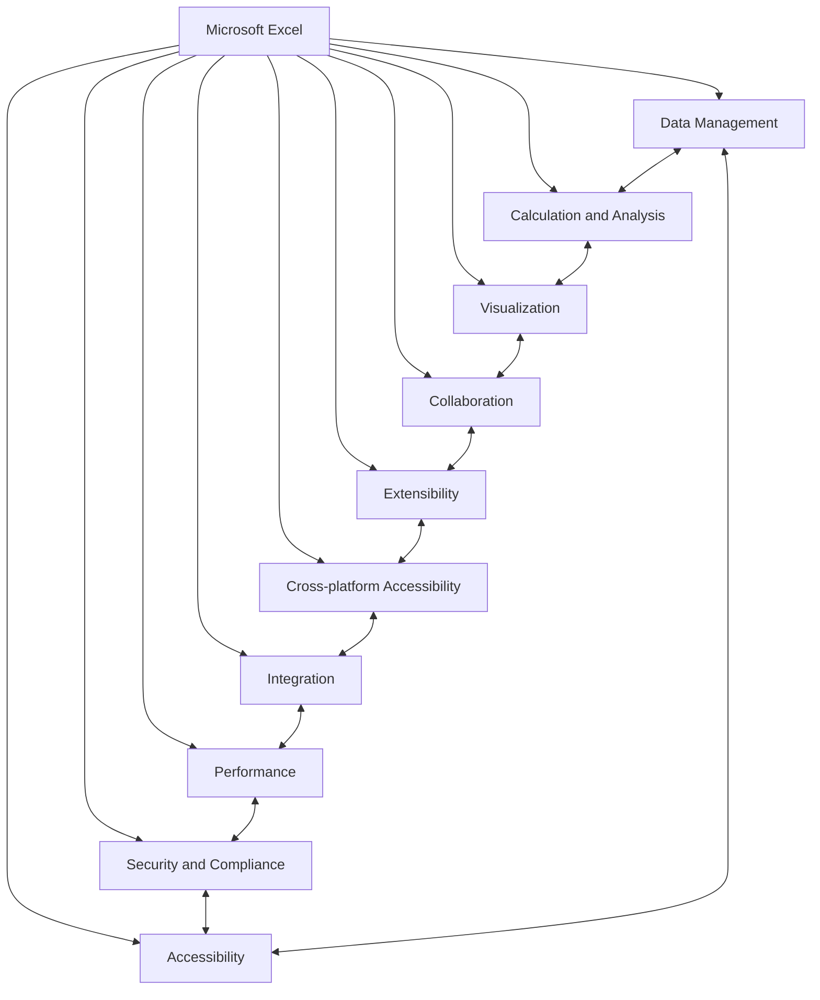

## 1.2 Scope

Microsoft Excel is a comprehensive spreadsheet application designed to meet the data management, analysis, and visualization needs of a wide range of users, from individuals to large enterprises. The scope of this software product encompasses:

### 1.2.1 Goals

1. Provide an intuitive and powerful platform for data manipulation and analysis
2. Enable users to create professional-quality visualizations and reports
3. Facilitate collaboration and data sharing within organizations
4. Offer advanced features for power users while maintaining accessibility for beginners
5. Ensure cross-platform compatibility and consistent user experience

### 1.2.2 Benefits

1. Increased productivity in data-related tasks
2. Improved decision-making through advanced analysis capabilities
3. Enhanced communication of data-driven insights
4. Streamlined collaboration within teams and organizations
5. Flexibility to create custom solutions across various industries and use cases

### 1.2.3 Core Functionalities

| Category | Functionalities |
|----------|-----------------|
| Data Input and Management | - Cell-based data entry and editing<br>- Support for multiple data types<br>- Data validation and error checking<br>- Import/export capabilities |
| Calculation and Formulas | - Built-in mathematical, statistical, and financial functions<br>- Custom formula creation<br>- Array formulas and dynamic arrays |
| Data Analysis | - Sorting and filtering<br>- Pivot Tables and Pivot Charts<br>- What-if analysis tools<br>- Statistical analysis and forecasting |
| Data Visualization | - Chart creation (bar, line, pie, scatter, etc.)<br>- Conditional formatting<br>- Sparklines<br>- Advanced chart customization |
| Collaboration and Sharing | - Real-time co-authoring<br>- Comments and annotations<br>- Version history<br>- Sharing controls and permissions management |
| Automation and Customization | - Macro recording and editing<br>- VBA programming for custom solutions<br>- Add-in support for extended functionality |
| Integration and Connectivity | - Connections to external data sources<br>- Power Query for data transformation<br>- Integration with other Microsoft Office applications |
| Cross-platform Support | - Desktop versions for Windows and macOS<br>- Web-based version for browser access<br>- Mobile applications for iOS and Android devices |
| Security and Compliance | - Data encryption and access controls<br>- Compliance with data protection regulations<br>- Audit logging and tracking |

By delivering these core functionalities, Microsoft Excel aims to provide a versatile and powerful tool that can adapt to the diverse needs of its user base, from simple data entry and basic calculations to complex financial modeling and data analysis.

# 5. SYSTEM ARCHITECTURE

## 5.1 PROGRAMMING LANGUAGES

Microsoft Excel utilizes a variety of programming languages to deliver its robust functionality across different platforms. The following table lists the primary programming languages used in the project and their justifications:

| Language | Purpose | Justification |
|----------|---------|---------------|
| C++ | Core engine, performance-critical components | High performance, low-level control, and extensive libraries for complex calculations |
| C# | Windows desktop application, .NET integration | Excellent for Windows desktop development, strong integration with .NET framework |
| Swift | iOS application | Native language for iOS development, offering performance and access to latest iOS features |
| Kotlin | Android application | Modern language for Android development, fully interoperable with Java |
| JavaScript/TypeScript | Web application, Office Add-ins | Wide browser support, rich ecosystem for web development, type safety with TypeScript |
| Python | Data analysis features, machine learning integration | Powerful for data manipulation and analysis, extensive libraries for ML and scientific computing |
| VBA (Visual Basic for Applications) | Macro programming, backward compatibility | Maintains compatibility with existing Excel macros and custom solutions |
| F# | Functional programming for specific algorithms | Excellent for implementing complex mathematical and financial algorithms |
| SQL | Database queries and data manipulation | Standard language for database operations and data retrieval |

## 5.2 HIGH-LEVEL ARCHITECTURE DIAGRAM

The following diagram provides an overview of Microsoft Excel's high-level architecture, showing the main components and their interactions:

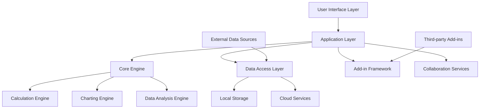

## 5.3 COMPONENT DIAGRAMS

The following component diagram details the specific modules within Microsoft Excel and their relationships:

```mermaid
component
    [User Interface] as UI
    [Formula Parser] as FP
    [Calculation Engine] as CE
    [Data Storage] as DS
    [Charting Engine] as ChE
    [Data Analysis Tools] as DAT
    [Add-in Manager] as AM
    [Collaboration Service] as CS
    [File I/O] as FIO
    [External Data Connector] as EDC
    [Security Manager] as SM

    UI --> FP
    UI --> ChE
    UI --> DAT
    UI --> AM
    FP --> CE
    CE --> DS
    ChE --> DS
    DAT --> DS
    CS --> DS
    FIO --> DS
    EDC --> DS
    SM --> DS
    SM --> CS
    SM --> EDC
```

## 5.4 SEQUENCE DIAGRAMS

The following sequence diagram illustrates the interaction between system components when a user enters a formula in Excel:

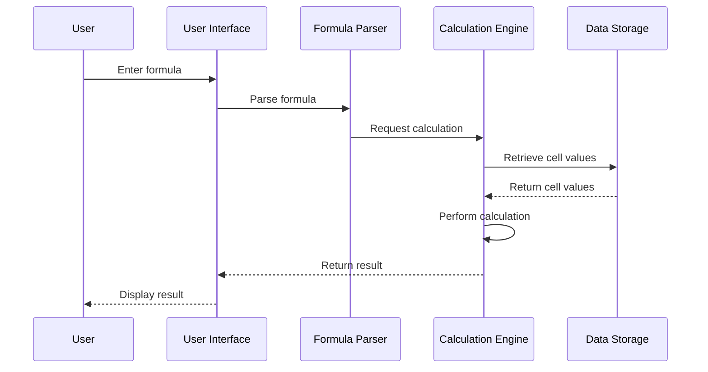

## 5.5 DATA-FLOW DIAGRAM

The following data-flow diagram explains how information moves through the Microsoft Excel system:

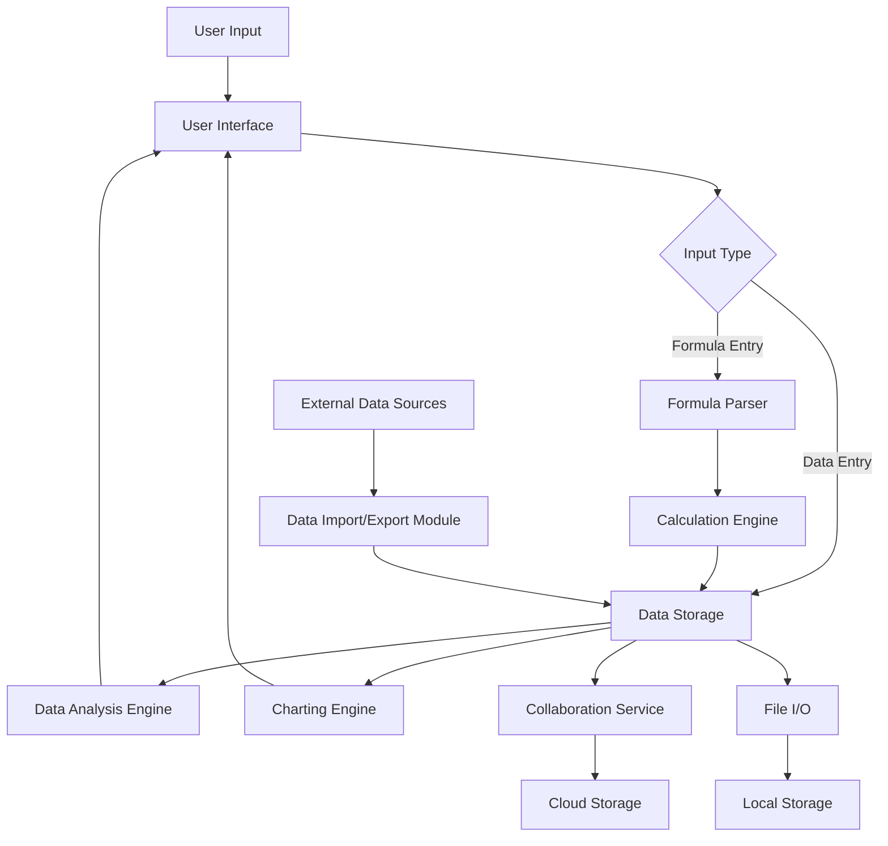

This data-flow diagram illustrates how data enters the system through user input or external sources, is processed by various components such as the Formula Parser and Calculation Engine, stored in either local or cloud storage, and then used by components like the Data Analysis Engine and Charting Engine to provide results back to the user interface.

The architecture of Microsoft Excel is designed to be modular, scalable, and efficient, allowing for easy maintenance, future enhancements, and cross-platform development. The separation of concerns between different components enables the system to handle complex operations while maintaining performance and reliability across various devices and use cases.

# 5. SYSTEM DESIGN

## 5.1 PROGRAMMING LANGUAGES

Microsoft Excel utilizes a variety of programming languages to deliver its robust functionality across different platforms. The following table lists the primary programming languages used in the project and their justifications:

| Language | Purpose | Justification |
|----------|---------|---------------|
| C++ | Core engine, performance-critical components | High performance, low-level control, and extensive libraries for complex calculations |
| C# | Windows desktop application, .NET integration | Excellent for Windows desktop development, strong integration with .NET framework |
| Swift | iOS application | Native language for iOS development, offering performance and access to latest iOS features |
| Kotlin | Android application | Modern language for Android development, fully interoperable with Java |
| JavaScript/TypeScript | Web application, Office Add-ins | Wide browser support, rich ecosystem for web development, type safety with TypeScript |
| Python | Data analysis features, machine learning integration | Powerful for data manipulation and analysis, extensive libraries for ML and scientific computing |
| VBA (Visual Basic for Applications) | Macro programming, backward compatibility | Maintains compatibility with existing Excel macros and custom solutions |
| F# | Functional programming for specific algorithms | Excellent for implementing complex mathematical and financial algorithms |
| SQL | Database queries and data manipulation | Standard language for database operations and data retrieval |

## 5.2 DATABASE DESIGN

While Microsoft Excel primarily uses file-based storage for workbooks, it also utilizes databases for certain features and cloud-based services. The database design focuses on supporting collaboration, versioning, and metadata management.

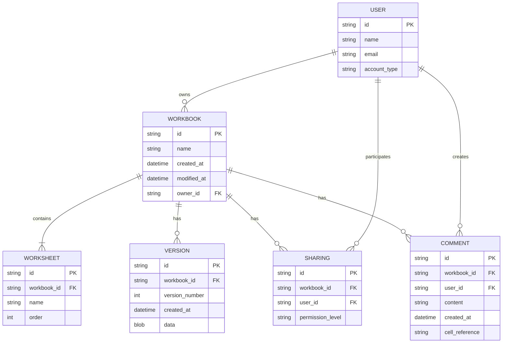

This database design supports:
- User management and authentication
- Workbook metadata and ownership
- Version control for cloud-based workbooks
- Sharing and collaboration features
- Comments and annotations

## 5.3 API DESIGN

Microsoft Excel's API design follows RESTful principles and uses JSON for data exchange. The API allows for integration with external systems and automation of Excel functionalities.

Key API endpoints:

1. Workbooks
   - GET /api/v1/workbooks
   - POST /api/v1/workbooks
   - GET /api/v1/workbooks/{id}
   - PUT /api/v1/workbooks/{id}
   - DELETE /api/v1/workbooks/{id}

2. Worksheets
   - GET /api/v1/workbooks/{id}/worksheets
   - POST /api/v1/workbooks/{id}/worksheets
   - GET /api/v1/workbooks/{id}/worksheets/{sheet_id}
   - PUT /api/v1/workbooks/{id}/worksheets/{sheet_id}
   - DELETE /api/v1/workbooks/{id}/worksheets/{sheet_id}

3. Cells
   - GET /api/v1/workbooks/{id}/worksheets/{sheet_id}/cells/{cell_ref}
   - PUT /api/v1/workbooks/{id}/worksheets/{sheet_id}/cells/{cell_ref}

4. Ranges
   - GET /api/v1/workbooks/{id}/worksheets/{sheet_id}/ranges/{range_ref}
   - PUT /api/v1/workbooks/{id}/worksheets/{sheet_id}/ranges/{range_ref}

5. Charts
   - GET /api/v1/workbooks/{id}/charts
   - POST /api/v1/workbooks/{id}/charts
   - GET /api/v1/workbooks/{id}/charts/{chart_id}
   - PUT /api/v1/workbooks/{id}/charts/{chart_id}
   - DELETE /api/v1/workbooks/{id}/charts/{chart_id}

6. Comments
   - GET /api/v1/workbooks/{id}/comments
   - POST /api/v1/workbooks/{id}/comments
   - GET /api/v1/workbooks/{id}/comments/{comment_id}
   - PUT /api/v1/workbooks/{id}/comments/{comment_id}
   - DELETE /api/v1/workbooks/{id}/comments/{comment_id}

Authentication is handled using OAuth 2.0, and rate limiting is implemented to ensure fair usage and system stability.

## 5.4 USER INTERFACE DESIGN

Microsoft Excel's user interface is designed to be intuitive, efficient, and consistent across platforms while adapting to the specific needs of each device type.

### Desktop Application (Windows/macOS)

```
+--------------------------------------------------------------------------------------------------+
|  File  Home  Insert  Page Layout  Formulas  Data  Review  View  Help                   [User]     |
+--------------------------------------------------------------------------------------------------+
| [New] [Open] [Save] [Print] [Undo] [Redo]  | A   ▼ | [B] [I] [U] | [%] [,] [.00] | [Merge] [$]   |
+--------------------------------------------------------------------------------------------------+
|     A    |    B    |    C    |    D    |    E    |    F    |    G    |    H    |    I    |    J   |
+--------------------------------------------------------------------------------------------------+
|  1 |     |         |         |         |         |         |         |         |         |        |
+--------------------------------------------------------------------------------------------------+
|  2 |     |         |         |         |         |         |         |         |         |        |
+--------------------------------------------------------------------------------------------------+
|  3 |     |         |         |         |         |         |         |         |         |        |
+--------------------------------------------------------------------------------------------------+
|  4 |     |         |         |         |         |         |         |         |         |        |
+--------------------------------------------------------------------------------------------------+
|  5 |     |         |         |         |         |         |         |         |         |        |
+--------------------------------------------------------------------------------------------------+
|                                                                                                  |
|                                                                                                  |
|                                                                                                  |
+--------------------------------------------------------------------------------------------------+
| Ready                                                                     Sheet1 Sheet2 Sheet3 + |
+--------------------------------------------------------------------------------------------------+
```

### Web Application

```
+--------------------------------------------------------------------------------------------------+
| [Excel Online Logo] [File] [Home] [Insert] [Data] [Review] [View]          [Share] [User]         |
+--------------------------------------------------------------------------------------------------+
| [Formula Bar                                                                                   ] |
+--------------------------------------------------------------------------------------------------+
|     A    |    B    |    C    |    D    |    E    |    F    |    G    |    H    |    I    |    J   |
+--------------------------------------------------------------------------------------------------+
|  1 |     |         |         |         |         |         |         |         |         |        |
+--------------------------------------------------------------------------------------------------+
|  2 |     |         |         |         |         |         |         |         |         |        |
+--------------------------------------------------------------------------------------------------+
|  3 |     |         |         |         |         |         |         |         |         |        |
+--------------------------------------------------------------------------------------------------+
|  4 |     |         |         |         |         |         |         |         |         |        |
+--------------------------------------------------------------------------------------------------+
|  5 |     |         |         |         |         |         |         |         |         |        |
+--------------------------------------------------------------------------------------------------+
|                                                                                                  |
|                                                                                                  |
|                                                                                                  |
+--------------------------------------------------------------------------------------------------+
| Sheet1 Sheet2 Sheet3 +                                                                           |
+--------------------------------------------------------------------------------------------------+
```

### Mobile Application (iOS/Android)

```
+--------------------------------------------------------------------------------------------------+
| [≡] Excel                                                                    [Share] [User]      |
+--------------------------------------------------------------------------------------------------+
| [Formula Bar                                                                                   ] |
+--------------------------------------------------------------------------------------------------+
|     A    |    B    |    C    |    D    |
+--------------------------------------------------------------------------------------------------+
|  1 |     |         |         |         |
+--------------------------------------------------------------------------------------------------+
|  2 |     |         |         |         |
+--------------------------------------------------------------------------------------------------+
|  3 |     |         |         |         |
+--------------------------------------------------------------------------------------------------+
|  4 |     |         |         |         |
+--------------------------------------------------------------------------------------------------+
|  5 |     |         |         |         |
+--------------------------------------------------------------------------------------------------+
|                                        |
|                                        |
|                                        |
+--------------------------------------------------------------------------------------------------+
| [Home] [Insert] [Formulas] [More...]                                                             |
+--------------------------------------------------------------------------------------------------+
```

## 5.5 THEME DESIGN

Microsoft Excel's theme design follows the Microsoft Fluent Design System, emphasizing clarity, depth, and motion. The color scheme is based on Microsoft's brand guidelines while allowing for customization and accessibility options.

Primary colors:
- Microsoft Blue: #0078D4
- White: #FFFFFF
- Light Gray: #F3F3F3
- Dark Gray: #252525

Accent colors:
- Green: #107C10
- Red: #D13438
- Yellow: #FFC83D
- Purple: #881798

Typography:
- Primary font: Segoe UI
- Fallback fonts: Arial, sans-serif

Key design principles:
1. Consistency: Maintain a consistent look and feel across all platforms while adapting to platform-specific guidelines.
2. Accessibility: Ensure high contrast ratios and support for screen readers.
3. Customization: Allow users to choose between light and dark themes, and customize the color scheme.
4. Responsiveness: Design UI elements to adapt smoothly to different screen sizes and orientations.

The theme design emphasizes a clean, modern look with subtle shadows and transparency effects to create a sense of depth. Animations and transitions are used judiciously to provide visual feedback and enhance the user experience without being distracting.

# 6. TECHNOLOGY STACK

## 6.1 PROGRAMMING LANGUAGES

Microsoft Excel utilizes a variety of programming languages to deliver its robust functionality across different platforms. The following table lists the primary programming languages used in the project and their justifications:

| Language | Purpose | Justification |
|----------|---------|---------------|
| C++ | Core engine, performance-critical components | High performance, low-level control, and extensive libraries for complex calculations |
| C# | Windows desktop application, .NET integration | Excellent for Windows desktop development, strong integration with .NET framework |
| Swift | iOS application | Native language for iOS development, offering performance and access to latest iOS features |
| Kotlin | Android application | Modern language for Android development, fully interoperable with Java |
| JavaScript/TypeScript | Web application, Office Add-ins | Wide browser support, rich ecosystem for web development, type safety with TypeScript |
| Python | Data analysis features, machine learning integration | Powerful for data manipulation and analysis, extensive libraries for ML and scientific computing |
| VBA (Visual Basic for Applications) | Macro programming, backward compatibility | Maintains compatibility with existing Excel macros and custom solutions |
| F# | Functional programming for specific algorithms | Excellent for implementing complex mathematical and financial algorithms |
| SQL | Database queries and data manipulation | Standard language for database operations and data retrieval |

## 6.2 FRAMEWORKS AND LIBRARIES

The following frameworks and libraries will be utilized in the development of Microsoft Excel:

| Framework/Library | Purpose | Justification |
|-------------------|---------|---------------|
| .NET Framework | Windows desktop application development | Provides a comprehensive and consistent programming model for building Windows applications |
| WPF (Windows Presentation Foundation) | UI development for Windows | Offers powerful UI capabilities and separation of concerns through XAML |
| Xamarin | Cross-platform mobile development | Allows code sharing between iOS and Android applications |
| React | Web application front-end | Provides a component-based architecture for building interactive UIs |
| ASP.NET Core | Web application back-end | Offers high performance, cross-platform capabilities for server-side logic |
| NumPy | Numerical computing for Python components | Provides efficient array operations and mathematical functions |
| Pandas | Data manipulation and analysis in Python | Offers powerful data structures and tools for working with structured data |
| Boost | C++ utility libraries | Provides a wide range of high-quality, peer-reviewed portable C++ libraries |
| Eigen | Linear algebra operations | Efficient C++ template library for matrix and vector operations |
| TensorFlow | Machine learning integration | Offers flexible ecosystem for implementing and deploying ML models |

## 6.3 DATABASES

Microsoft Excel employs various database systems to support its functionality:

| Database | Purpose | Justification |
|----------|---------|---------------|
| SQLite | Local data storage for desktop applications | Lightweight, serverless database ideal for local storage of application data |
| Azure SQL Database | Cloud-based relational database | Scalable, fully managed database service for cloud storage of user data and metadata |
| Azure Cosmos DB | NoSQL database for web and mobile applications | Globally distributed, multi-model database for handling diverse data types and scaling requirements |
| Redis | In-memory data structure store | High-performance caching and real-time data processing for collaborative features |

## 6.4 THIRD-PARTY SERVICES

The following third-party services and APIs will be integrated into Microsoft Excel:

| Service/API | Purpose | Justification |
|-------------|---------|---------------|
| Microsoft Graph API | Access to Microsoft 365 services and data | Provides a unified programmability model for accessing data across Microsoft 365 services |
| Azure Active Directory | Authentication and authorization | Offers secure and scalable identity and access management |
| OneDrive API | Cloud storage and file synchronization | Enables seamless integration with Microsoft's cloud storage solution |
| Bing Maps API | Geospatial data visualization | Allows integration of mapping and location-based services into Excel |
| Power BI API | Advanced data visualization and business intelligence | Enables creation and embedding of rich, interactive data visualizations |
| LinkedIn API | Professional data integration | Allows users to incorporate professional network data into spreadsheets |
| Alpha Vantage API | Financial market data | Provides real-time and historical financial data for stock market analysis features |
| OpenWeatherMap API | Weather data integration | Enables incorporation of weather data into spreadsheets and forecasting models |

The technology stack for Microsoft Excel is designed to leverage the strengths of various programming languages, frameworks, and services to deliver a powerful, cross-platform spreadsheet application. The combination of high-performance languages like C++ for core functionality, modern web technologies for the online version, and platform-specific languages for native mobile apps ensures optimal performance and user experience across all supported platforms.

# 7. SECURITY CONSIDERATIONS

## 7.1 AUTHENTICATION AND AUTHORIZATION

Microsoft Excel implements a robust authentication and authorization system to ensure secure access to the application and its features across various platforms.

### 7.1.1 Authentication Methods

| Method | Description | Applicable Platforms |
|--------|-------------|----------------------|
| Microsoft Account | Personal Microsoft accounts for consumer users | All platforms |
| Azure Active Directory (Azure AD) | Enterprise identity provider for organizational accounts | All platforms |
| Multi-Factor Authentication (MFA) | Additional security layer requiring a second form of verification | All platforms |
| Single Sign-On (SSO) | Allows users to access multiple Microsoft services with a single login | Web and mobile applications |

### 7.1.2 Authorization Model

Excel uses a role-based access control (RBAC) system to manage user permissions within shared workbooks and organizational resources.

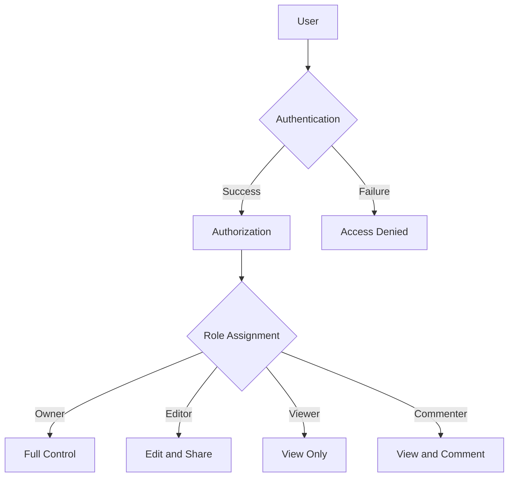

### 7.1.3 API Security

For Excel's API and add-in ecosystem:

- OAuth 2.0 protocol for secure API authorization
- Scoped permissions to limit API access to specific resources
- JWT (JSON Web Tokens) for secure information exchange

## 7.2 DATA SECURITY

Excel implements multiple layers of security to protect user data throughout its lifecycle.

### 7.2.1 Data Encryption

| State | Encryption Method |
|-------|-------------------|
| Data at Rest | AES 256-bit encryption |
| Data in Transit | TLS 1.3 protocol |
| File-Level Encryption | User-defined passwords with AES encryption |

### 7.2.2 Data Loss Prevention (DLP)

- Integration with Microsoft 365 DLP policies
- Content scanning to detect and protect sensitive information
- Automatic classification of documents based on content

### 7.2.3 Data Access Controls

- Fine-grained permissions at the workbook, worksheet, and range levels
- Conditional access policies based on user location, device state, and risk level
- Data access auditing and logging

### 7.2.4 Data Residency and Compliance

- Support for data residency requirements in various geographic regions
- Compliance with GDPR, CCPA, HIPAA, and other relevant data protection regulations
- Regular compliance audits and certifications (e.g., ISO 27001, SOC 2)

## 7.3 SECURITY PROTOCOLS

Excel adheres to industry-standard security protocols and best practices to maintain a secure environment for users and their data.

### 7.3.1 Secure Development Lifecycle (SDL)

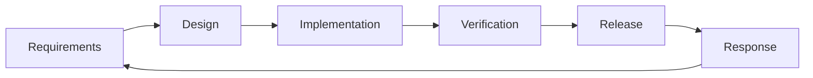

- Threat modeling during the design phase
- Regular security code reviews and static code analysis
- Penetration testing and vulnerability assessments

### 7.3.2 Vulnerability Management

- Continuous monitoring for new vulnerabilities
- Regular security patches and updates
- Responsible disclosure program for external security researchers

### 7.3.3 Incident Response

- Dedicated security incident response team
- Predefined procedures for detecting, analyzing, and mitigating security incidents
- Regular incident response drills and simulations

### 7.3.4 Security Monitoring and Logging

- Real-time monitoring of system activities and user behaviors
- Centralized log management with Azure Sentinel integration
- Automated alerts for suspicious activities

### 7.3.5 Third-Party Security

- Rigorous security assessment for third-party add-ins and integrations
- Sandboxed execution environment for add-ins to prevent unauthorized access
- Regular security audits of third-party dependencies

### 7.3.6 Physical Security

- Secure data centers with multi-layered physical security controls
- Biometric access controls and 24/7 surveillance
- Regular physical security audits and assessments

By implementing these comprehensive security measures, Microsoft Excel ensures the confidentiality, integrity, and availability of user data while providing a secure and compliant environment for spreadsheet creation and collaboration.

# 8. INFRASTRUCTURE

## 8.1 DEPLOYMENT ENVIRONMENT

Microsoft Excel is designed to be deployed across multiple environments to cater to diverse user needs and organizational requirements. The deployment strategy encompasses on-premises, cloud, and hybrid solutions.

| Environment | Description | Use Case |
|-------------|-------------|----------|
| On-premises | Installed locally on user devices or organization servers | For users with strict data privacy requirements or limited internet connectivity |
| Cloud | Hosted on Microsoft Azure cloud infrastructure | For users requiring accessibility from multiple devices and locations |
| Hybrid | Combination of on-premises and cloud deployment | For organizations transitioning to cloud or with mixed infrastructure requirements |

The hybrid model allows for seamless integration between on-premises and cloud deployments, enabling users to leverage the benefits of both environments.

## 8.2 CLOUD SERVICES

Microsoft Excel primarily utilizes Microsoft Azure cloud services to provide a robust, scalable, and secure infrastructure for its cloud-based features and deployments.

| Azure Service | Purpose | Justification |
|---------------|---------|---------------|
| Azure App Service | Hosting Excel Online | Provides scalable and reliable web hosting with easy integration with other Azure services |
| Azure SQL Database | Data storage for user accounts, settings, and metadata | Offers a fully managed relational database with high availability and performance |
| Azure Blob Storage | Storage for Excel files and large datasets | Provides cost-effective, scalable storage for unstructured data |
| Azure Active Directory | User authentication and authorization | Ensures secure access control and integrates with existing Microsoft ecosystems |
| Azure CDN | Content delivery for static assets | Improves performance by caching content closer to users |
| Azure Functions | Serverless compute for background tasks | Enables efficient execution of tasks like file conversion and data processing |
| Azure Cognitive Services | AI-powered features | Enhances Excel's capabilities with machine learning and natural language processing |

## 8.3 CONTAINERIZATION

Microsoft Excel leverages containerization technology to improve deployment consistency, scalability, and resource utilization, particularly for its cloud-based components.

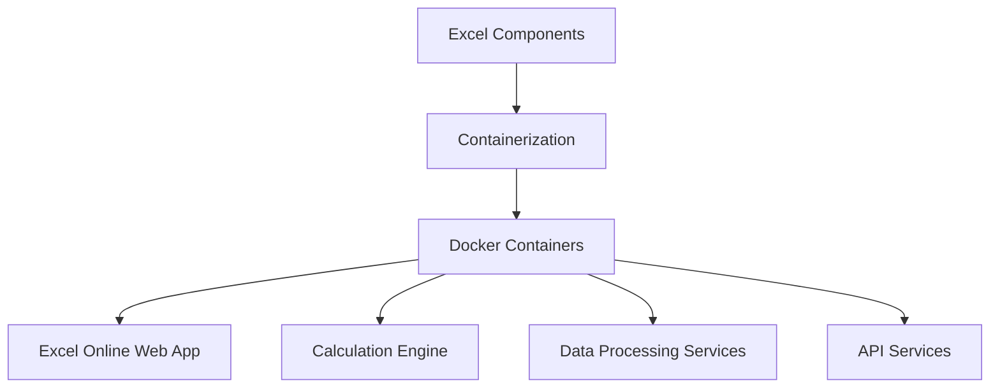

Docker is used to containerize various Excel components, providing the following benefits:
- Consistent environment across development, testing, and production
- Improved scalability and resource efficiency
- Easier management of microservices architecture
- Faster deployment and updates

## 8.4 ORCHESTRATION

To manage the containerized components of Microsoft Excel, especially in the cloud environment, Kubernetes is employed for container orchestration.

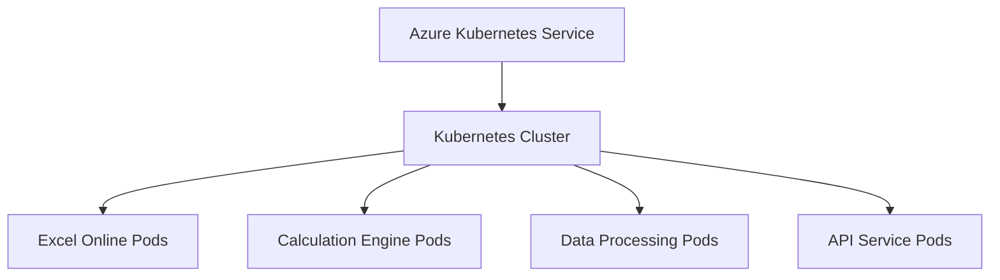

Kubernetes provides:
- Automated deployment and scaling of Excel services
- Load balancing across multiple instances
- Self-healing capabilities for high availability
- Efficient resource allocation and utilization

Azure Kubernetes Service (AKS) is used to manage the Kubernetes infrastructure, providing a fully managed Kubernetes platform that integrates seamlessly with other Azure services.

## 8.5 CI/CD PIPELINE

Microsoft Excel employs a robust Continuous Integration and Continuous Deployment (CI/CD) pipeline to ensure rapid, reliable, and consistent delivery of updates and new features.

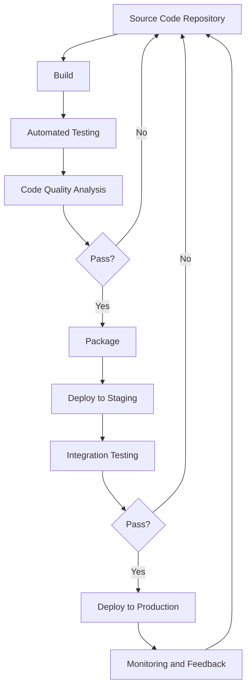

The CI/CD pipeline includes the following key components:

1. **Version Control**: Git is used for source code management, with repositories hosted on Azure DevOps.

2. **Build Automation**: Azure Pipelines is used to automate the build process for different components of Excel.

3. **Automated Testing**: Includes unit tests, integration tests, and end-to-end tests using frameworks like MSTest and Selenium.

4. **Code Quality Analysis**: Tools like SonarQube are integrated to ensure code quality and identify potential issues.

5. **Artifact Management**: Azure Artifacts is used to store and manage build outputs and dependencies.

6. **Deployment Automation**: Azure Pipelines is used in conjunction with Azure Resource Manager templates for automated deployments.

7. **Environment Management**: Separate environments for development, testing, staging, and production are maintained, with appropriate access controls and configurations.

8. **Monitoring and Feedback**: Azure Application Insights is used for real-time monitoring and telemetry, providing feedback for continuous improvement.

This comprehensive CI/CD pipeline ensures that updates to Microsoft Excel are thoroughly tested and reliably deployed, maintaining high quality and stability while enabling rapid iteration and feature delivery.

# APPENDICES

## A. TECHNICAL INFORMATION

### A.1 Excel File Format Specifications

The primary file format for Microsoft Excel is .xlsx, which is based on the Office Open XML standard. Here's a brief overview of the file structure:

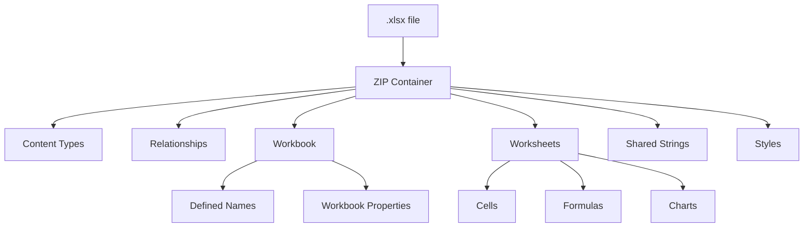

### A.2 Excel Calculation Chain

The calculation chain in Excel determines the order in which formulas are evaluated. Here's a simplified representation:

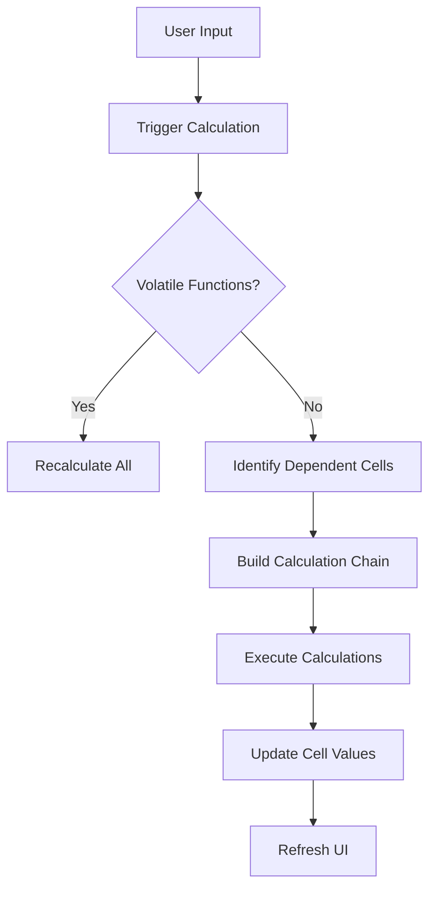

### A.3 Excel Add-in Architecture

Excel supports various types of add-ins. Here's an overview of the add-in architecture:

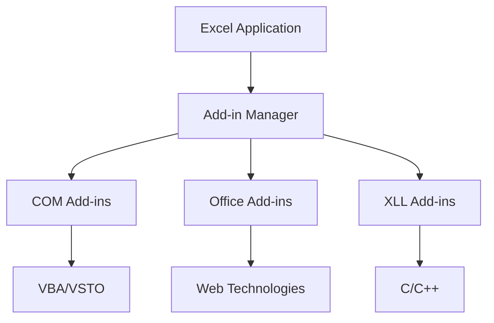

## B. GLOSSARY

| Term | Definition |
|------|------------|
| Array Formula | A formula that performs multiple calculations on one or more sets of values, and then returns either a single result or multiple results. |
| Data Model | A feature in Excel that allows you to integrate data from multiple tables, effectively building a relational data source inside an Excel workbook. |
| Dynamic Array | A feature that allows formulas to return multiple results that automatically spill into neighboring cells. |
| Power Pivot | An Excel add-in that enables you to import millions of rows of data from multiple data sources into a single Excel workbook. |
| Slicer | A visual filter that lets you quickly filter PivotTable data by clicking buttons. |
| Solver | An Excel add-in program you can use for what-if analysis by finding an optimal value for a formula in one cell—called the objective cell—subject to constraints, or limits, on the values of other formula cells on a worksheet. |
| Structured Reference | A way of referring to Excel tables and their parts by using meaningful names instead of cell references. |

## C. ACRONYMS

| Acronym | Expanded Form |
|---------|---------------|
| AES | Advanced Encryption Standard |
| CCPA | California Consumer Privacy Act |
| COM | Component Object Model |
| CSV | Comma-Separated Values |
| DAX | Data Analysis Expressions |
| ETL | Extract, Transform, Load |
| GDPR | General Data Protection Regulation |
| HIPAA | Health Insurance Portability and Accountability Act |
| IRM | Information Rights Management |
| MTBF | Mean Time Between Failures |
| ODBC | Open Database Connectivity |
| OLE DB | Object Linking and Embedding Database |
| RBAC | Role-Based Access Control |
| SOC | Service Organization Control |
| SOX | Sarbanes-Oxley Act |
| SUS | System Usability Scale |
| VSTO | Visual Studio Tools for Office |
| WCAG | Web Content Accessibility Guidelines |
| XLL | Excel Link Library |